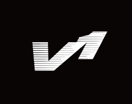

<!--
Hey, thanks for using the awesome-readme-template template.  
If you have any enhancements, then fork this project and create a pull request 
or just open an issue with the label "enhancement".

Don't forget to give this project a star for additional support ;)
Maybe you can mention me or this repo in the acknowledgements too
-->

  
  <h1>VulkanOne</h1>
  
  

    A Shitty Vulkan Renderer 
  

  
  
<!-- Badges -->

  
  
  
  
  
  

   
<h4>
    <a href="https://github.com/pkayee/VulkanOne/">Documentation</a>
   · 
    <a href="https://github.com/pkayee/VulkanOne/issues/">Report Bug</a>
   · 
    <a href="https://github.com/pkayee/VulkanOne/issues/">Request Feature</a>
  </h4>

<h3>
  📞Contact Me
</h3>
 
  
  usr:juspkaye
  
</h4>

 

<!-- Table of Contents -->
# :notebook_with_decorative_cover: About the project
this is my first attempt at learning vulkan the resources im mainly using to learn are vulkan-tutorial.com and vulkan.org
but alot of the code structure is taken from this video series 
https://youtube.com/playlist?list=PL8327DO66nu9qYVKLDmdLW_84-yE4auCR&si=tbGld6L-7Qhbma3-

  
