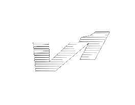

<!--
checkout the read me template i used 
https://github.com/Louis3797/awesome-readme-template/tree/main
-->

 
   
  
  <h1>VulkanOne</h1>
  
  

    A Shitty Vulkan Renderer 
  

  
  
<!-- Badges -->

 
 
 
 

   
<h4>
    <a href="https://github.com/pkayee/VulkanOne/">Documentation</a>
   · 
    <a href="https://github.com/pkayee/VulkanOne/issues/">Report Bug</a>
   · 
    <a href="https://github.com/pkayee/VulkanOne/issues/">Request Feature</a>
  </h4>

<h3>
  📞Contact Me
</h3>

&nbsp;

  
  
</h4>

 

<!-- Table of Contents -->
# :notebook_with_decorative_cover: About the project
this is my first attempt at learning vulkan the resources im mainly using to learn are vulkan-tutorial.com and vulkan.org
but alot of the code structure is taken from this video series 
https://youtube.com/playlist?list=PL8327DO66nu9qYVKLDmdLW_84-yE4auCR&si=tbGld6L-7Qhbma3-

  
